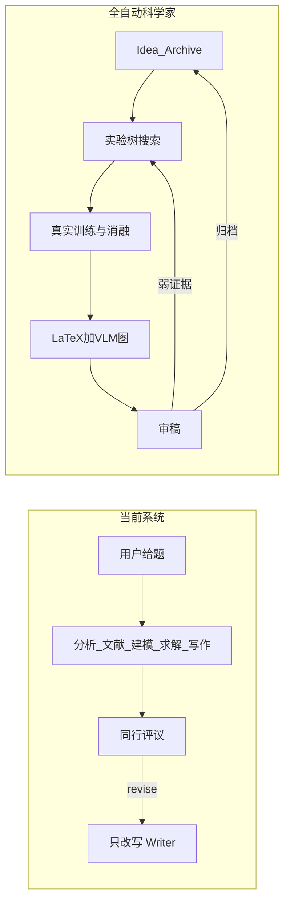

# 与全自动 AI 顶会科学家的缺口分析

## 定位结论

你们当前是 **「多场景学术论文生产系统」**（数学建模 / 课程作业 / CCF-A 模板），核心优势是 **Code-as-Truth、沙箱执行、事实校验、LaTeX 成稿、camera-ready**。  
对照 2024–2026 的「全自动科学家」（Sakana AI Scientist v1/v2、HKUDS AI-Researcher、AutoResearchClaw），差距不在「有没有 Agent」，而在 **是否拥有假设并改变世界状态（跑实验→改假设→再跑）的闭环与搜索深度**。

业界现状也要校准：**主会轨「顶会科学家」尚未被真正解决**（PaperBench 复现约 21%；Sakana v2 仅到 ICLR workshop）。你们的合理对标是：先追齐 **workshop 级科学家闭环**，同时把建模赛道做到 MM-Agent 级方法库与赛制交付。

---

## 你们已对齐的能力（不必重复建设）

| 能力         | 证据                                                                                                                                                                      |
| ---------- | ----------------------------------------------------------------------------------------------------------------------------------------------------------------------- |
| 端到端编排      | `[langgraph_orchestrator.py](backend/app/agents/langgraph_orchestrator.py)`：preflight → 并行分析 → 建模/算法 → experiment → solver → figure → writer → peer_review → fact_check |
| 数字来自执行     | sandbox + AST audit + fact_checker + reference_verifier                                                                                                                 |
| CCF-A 实验设计 | `[experimentation_agent.py](backend/app/agents/experimentation_agent.py)` + `[experiment_executor.py](backend/app/services/experiment_executor.py)`                     |
| 浅层实验迭代     | `_evaluate_experiment_quality`：缺 baseline/ablation 时回到 experiment                                                                                                       |
| 单任务创新提案    | `[innovation_agent.py](backend/app/agents/innovation_agent.py)`                                                                                                         |
| 成稿与打包      | 多模板 LaTeX + camera-ready ZIP + Next.js SSE                                                                                                                              |
| HITL 闸门    | `wait_user` / ChatRoom / use_critique                                                                                                                                   |

---

## 关键缺口（按对「科学家」身份的杀伤力排序）

### G1 — 审稿不能驱动重实验（最大结构性缺口）

**现状**：`[_route_peer_review](backend/app/agents/langgraph_orchestrator.py)` 的 `revise` **只回到 `writer`**，最多约 3 轮改文后 auto-accept。  
**科学家标准**：弱结果 / 缺消融 / 基线不公平 → 应路由回 `experiment` 或 `solver`，再重写。  
**缺口本质**：你们是 **写作修订环**，不是 **证据修订环**。

### G2 — 没有开放式选题与跨论文 Idea Archive

**现状**：用户给题 → 单次 `innovation_agent` 产出 gaps/ideas；有任务内 memory / paper_memory，**没有**跨 run 的「想法库 + 趣味性/新颖性/可行性打分 + 复用历史审稿」。  
**科学家标准**（Sakana）：从 archive 生成方向 → Semantic Scholar 近重复检测 → 跑完归档 → 下一轮进化。  
**缺口**：仍是 **题目驱动的助手**，不是 **自主选题的实验室**。

### G3 — 实验搜索深度不够（无 progressive tree search）

**现状**：

- 实验迭代条件很浅：仅「有无 baseline_comparison / ablation_study」字段（`[_evaluate_experiment_quality](backend/app/agents/langgraph_orchestrator.py)`）。
- NAS / LossDesign / AutoML 挂在 experiment 节点，但规模约 `population_size=6, max_generations=3`，偏演示。
- 无 AI Scientist-v2 式 **并行试验树 / 节点 checkpoint / 失败 Pivot 换假设**。

**科学家标准**：test-time compute 砸在实现与消融上，不是砸在改 LaTeX 上。

### G4 — 强基线与 SOTA 对齐能力弱

**现状**：plan 里写 baselines 名称；executor 会下数据、生成 train/eval 脚本，但缺少：

- 固定「可复现强基线套件」（公开实现 + 锁定依赖）
- 与公开 leaderboard / 标准协议对齐的成功判据
- PaperBench 级「声明—实现—表格」一致性 rubric

**科学家标准**：主会可信度来自 **公平对比与工程保真**，不是 NAS 小搜。

### G5 — 图表无 VLM 内容/美学闭环

**现状**：`figure_agent` 规划并出图。  
**科学家标准（v2）**：VLM 读图 → 改代码/改 caption → 再编译。  
**缺口**：易出「好看但与结果文件不一致 / 重复图 / 错误 caption」。

### G6 — 新颖性验证偏软

**现状**：文献检索 + 引用 DOI/arXiv 校验；`innovation_agent` 自述 novelty。  
**科学家标准**：近重复检索（标题/摘要/方法）、假引用硬拒、可选人类 novelty gate。  
**缺口**：防「重组式伪创新」与防幻觉引用深度不够。

### G7 — 复现包与外部验证未产品化

**现状**：camera-ready ZIP、种子字段在 plan 里出现。  
**缺口**：缺统一「一键复现」契约（env lock、数据 hash、config、raw logs → claims 追溯表）；无 workshop 投稿 / 盲审抽检流程；无内部 PaperBench 式自测集。

### G8 — 基础设施与工程债（拖慢科学家能力）

来自 `[项目改进路线.md](项目改进路线.md)` 与代码现实：

- 双沙箱（`core/sandbox.py` vs `services/code_sandbox.py`）策略不一致
- 网络隔离偏代理环境变量，非硬隔离
- 真实 e2e（真 LLM + 真 GPU 长链路）验证不足
- NAS/Loss 曾有假评估器历史；现有真实评估仍受单卡 VRAM 限制
- 遗留 CLI（`src/`）与 backend 能力分裂

### G9 — 数学建模赛道相对 MM-Agent 的缺口

| 赛道需求                            | 你们                               | 典型全自动建模（MM-Agent 等） |
| ------------------------------- | -------------------------------- | ------------------- |
| 给定开放题 → 假设与子问题                  | 强（analyzer / modeler）            | 强                   |
| **可检索方法库**（AHP/LP/SIR/… 数十～近百种） | 主要靠 LLM + 一般 KB，缺 HMML 级结构化方法库   | 核心资产                |
| 时限内 CPU 求解 + 灵敏度/情景             | solver 有，场景化深度不一                 | 强调                  |
| 国赛/美赛模板与「国一审稿」rubric            | 有 math_modeling 模板 + peer_review | 赛制专用审稿更贴            |
| 开放式 ML 发现 archive               | 非主目标                             | 也不该是主目标             |

**结论**：建模赛道应补 **方法库 + 赛制审稿 + 假设—求解—灵敏度闭环**，不要照搬 Sakana 的开放式 ML archive 作为主 KPI。

---

## 与「顶会科学家」能力清单对照（压缩版）

- **已有**：文献检索骨架、实验设计 JSON、沙箱执行、写稿、LLM 审稿改写、部分引用校验、任务级记忆  
- **弱 / 缺**：开放选题 archive、新颖性硬校验、实验树搜索、审稿→重实验、VLM 图闭环、强基线套件、一键复现、跨 run 进化、外部人类审稿里程碑  
- **建模专用缺**：HMML 式方法库、赛制评分对齐

---

## 建议补齐顺序（若后续进入实现）

1. **P0 — 证据闭环**：peer_review 按缺陷类型路由（文笔→writer；缺实验/数字矛盾→experiment/solver）；claims↔日志追溯表。
2. **P0 — 实验质量判据升级**：用真实 metrics / 失败率 / 缺表项驱动迭代，替代「字段是否存在」。
3. **P1 — Idea Archive + 近重复新颖性检查**（可选 HITL：是否值得烧 GPU）。
4. **P1 — 强基线套件 + 复现 bundle**（比扩大 NAS 更值）。
5. **P2 — VLM 图审 + 浅树搜索（beam/parallel seeds）**。
6. **P2 — 建模方法库（结构化检索 + 代码模板）**。
7. **P3 — 统一沙箱、硬网络隔离、真 e2e 评测集**；workshop 级外测作为里程碑，主会另立标准。

---

## 一句话差距

你们离「全自动顶会科学家」差的不是 Agent 数量或 LaTeX，而是：**自主选题 + 深实验搜索 + 审稿能打回实验 + 跨轮进化与硬验证**；同时建模赛道还缺 **可检索方法库与赛制级审稿对齐**。